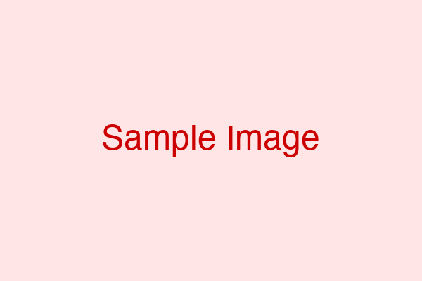

# custom.css 完全解説（初心者向け）

このドキュメントでは、`.marp/themes/custom.css` の各部分が、`base.md` のどの部分にどのように適用されるかを詳しく解説します。

---

## 目次

1. [基本設定](#基本設定)
2. [見出しのスタイル](#見出しのスタイル)
3. [本文・リストのスタイル](#本文リストのスタイル)
4. [ヘッダー・フッター](#ヘッダーフッター)
5. [2カラムレイアウト](#2カラムレイアウト)
6. [3カラムレイアウト](#3カラムレイアウト)
7. [特殊なページ設定](#特殊なページ設定)

---

## 基本設定

### 1. テーマ宣言と読み込み（1〜3行目）

```css
/* @theme custom */

@import 'default';
```

**意味：**
- `/* @theme custom */` → このCSSファイルを「custom」という名前のテーマとして登録
- `@import 'default';` → Marpのデフォルトテーマを読み込む（その上から上書きする）

**MD側での使い方：**
```markdown
---
theme: custom  ← ここでテーマ名を指定
---
```

---

### 2. スライド全体の設定（5〜11行目）

```css
section {
  background-color: #ffffff;        /* 背景色：白 */
  color: #333333;                   /* 文字色：濃いグレー */
  font-family: 'Hiragino Sans', 'Meiryo', sans-serif;  /* フォント */
  padding: 0 50px 60px 50px;        /* 内側の余白 */
  justify-content: flex-start;      /* 内容を上寄せ */
}
```

**適用される場所：**
- **全てのスライドページ**

**MDでの対応：**
```markdown
---  ← この区切りでページが分かれる
## [セクション1のタイトル]  ← この内容が section の中に入る
- ポイント1
---  ← 次のページへ
```

**padding の意味：**
```
padding: 上 右 下 左;
padding: 0 50px 60px 50px;
         ↓  ↓   ↓   ↓
         上  右  下  左
```
- 上：0px（余白なし）
- 右：50px
- 下：60px
- 左：50px

---

### 3. 下部の赤いバー（13〜22行目）

```css
section::after {
  content: '';
  position: absolute;
  bottom: 0;                /* 下端に配置 */
  left: 0;                  /* 左端から */
  right: 0;                 /* 右端まで */
  height: 30px;             /* 高さ30px */
  background-color: #CC0000;  /* 赤色 */
  z-index: 0;
}
```

**適用される場所：**
- **全てのスライドの一番下**
- フッターの背景として表示される赤いバー

**視覚的なイメージ：**
```
┌──────────────────┐
│  スライド内容    │
│                  │
│                  │
├──────────────────┤
│ 赤いバー (30px) │ ← これ
└──────────────────┘
```

---

## 見出しのスタイル

### 4. 見出し1（h1）のスタイル（24〜31行目）

```css
h1 {
  color: #CC0000;              /* 文字色：赤 */
  border-bottom: 2px solid #CC0000;  /* 下線：2pxの赤線 */
  padding-bottom: 4px;         /* 下線と文字の間隔 */
  margin-top: 0.8em;           /* 上の余白 */
  margin-bottom: 0.2em;        /* 下の余白 */
  font-size: 1.4em;            /* 文字サイズ */
}
```

**MD側での書き方：**
```markdown
# 1．[タイトル1] 20:00~20:30  ← これが h1
```

**適用される場所：**
- アジェンダページの「1．[タイトル1]」「2．[タイトル2]」など

**margin の意味：**
```
       ← margin-top: 0.8em （上の余白）
┌────────────────────┐
│ # 見出し1          │
└────────────────────┘
       ← margin-bottom: 0.2em （下の余白）
- リスト項目
```

**`em` とは？**
- `1em` = 現在の文字サイズと同じ大きさ
- `0.8em` = 文字サイズの0.8倍
- `px`（ピクセル）と違い、文字サイズに応じて自動調整される

---

### 5. 見出し2（h2）のスタイル（33〜40行目）

```css
h2 {
  color: #ffffff;              /* 文字色：白 */
  background-color: #CC0000;   /* 背景色：赤 */
  padding: 8px 20px;           /* 内側の余白（上下8px、左右20px）*/
  margin: 0 -50px 15px -50px;  /* 外側の余白 */
  position: relative;
  z-index: 10;
}
```

**MD側での書き方：**
```markdown
## [セクション1のタイトル] (1カラム)  ← これが h2
## アジェンダ (1カラム)              ← これも h2
```

**適用される場所：**
- 各ページの一番上にある赤い帯のタイトル

**margin のマイナス値の意味：**
```
通常のsection幅
┌─────────────────┐
│                 │
├─────────────────┤

margin: 0 -50px 15px -50px を適用
    ↓ 左に50px拡張    ↓ 右に50px拡張
┌───────────────────────┐
│ ## タイトル          │ ← 画面いっぱいに広がる
└───────────────────────┘
        ↓ 下に15pxの余白
```

---

## 本文・リストのスタイル

### 6. 段落（p）のスタイル（42〜47行目）

```css
section > p,
section > blockquote {
  background-color: #FFE5E5;  /* 背景色：ピンク */
  padding: 20px;              /* 内側の余白 */
  border-radius: 5px;         /* 角を丸く */
}
```

**MD側での書き方：**
```markdown
[セクション1の導入文や概要を記載]  ← これが p（段落）
```

**適用される場所：**
- 通常の文章（段落）
- 引用文（blockquote）

**`section > p` の意味：**
- `>` は「直接の子要素」という意味
- `section` の直下にある `p` だけに適用
- カラム内の `p` には適用されない（後で別に設定）

---

### 7. リスト（ul, ol）のスタイル（49〜60行目）

```css
section > ul,
section > ol {
  background-color: #FFE5E5;     /* 背景色：ピンク */
  padding: 6px 10px 6px 30px;    /* 内側の余白 */
  border-radius: 5px;            /* 角を丸く */
  margin-left: 0;
  margin-top: 0.1em;             /* 上の余白（見出しとの間隔）*/
  margin-bottom: 0.4em;          /* 下の余白 */
  list-style-position: outside;  /* 箇条書きの位置 */
  font-size: 0.8em;              /* 文字サイズ（80%）*/
  line-height: 1.3;              /* 行間 */
}
```

**MD側での書き方：**
```markdown
- [項目1]  ← これが ul（箇条書きリスト）
- [項目2]
- [項目3]
```

**適用される場所：**
- 箇条書きリスト（`-` で始まる）
- 番号付きリスト（`1.` で始まる）

**padding の詳細：**
```
padding: 6px 10px 6px 30px;
         ↓   ↓    ↓   ↓
         上  右   下  左

┌────────────────────┐
│ 6px  ← 上          │
│ 30px  - 項目1  10px│
│  ←左   - 項目2  →右│
│ 6px  ← 下          │
└────────────────────┘
```

**重要：margin-top と margin-bottom**
```
# 見出し
       ← margin-bottom: 0.2em （h1の下余白）
       ← margin-top: 0.1em （ulの上余白）
┌──────────────┐
│ - 項目1      │
│ - 項目2      │
└──────────────┘
       ← margin-bottom: 0.4em （ulの下余白）
```

---

### 8. 太字（strong）のスタイル（62〜65行目）

```css
strong {
  color: #CC0000;       /* 文字色：赤 */
  font-weight: bold;    /* 太字 */
}
```

**MD側での書き方：**
```markdown
**太字にしたい文字**  ← これが strong
```

---

## ヘッダー・フッター

### 9. ヘッダーを非表示（67〜69行目）

```css
header {
  display: none;  /* 表示しない */
}
```

**意味：**
- Marpのデフォルトヘッダーを非表示にする

---

### 10. フッターのスタイル（76〜90行目）

```css
footer {
  display: flex;                /* フレックスボックスで配置 */
  justify-content: space-between;  /* 左右に分散配置 */
  align-items: center;          /* 垂直方向の中央揃え */
  color: #ffffff;               /* 文字色：白 */
  padding-left: 20px;
  padding-right: 20px;
  padding-bottom: 8px;
  font-size: 0.9em;             /* 文字サイズ */
  position: absolute;           /* 絶対配置 */
  bottom: 0;                    /* 下端に配置 */
  left: 0;
  right: 0;
  z-index: 10;                  /* 赤いバーの上に表示 */
}
```

**MD側での設定：**
```markdown
---
footer: "**SAMURAI** __Marp samples__"  ← ここで内容を指定
---
```

**表示イメージ：**
```
┌──────────────────────────┐
│                          │
│  スライド内容            │
│                          │
├──────────────────────────┤
│ SAMURAI    Marp samples │ ← フッター
└──────────────────────────┘
```

---

## 2カラムレイアウト

### 11. 2カラムの基本設定（115〜120行目）

```css
.flex {
  display: grid;                      /* グリッドレイアウト */
  grid-template-columns: 1fr 1fr;     /* 2列に分割（1:1）*/
  gap: 2em;                           /* 列の間隔 */
  width: 100%;
}
```

**MD側での書き方：**
```markdown
<div class="flex sa">  ← ここで .flex クラスを指定
<div>
左カラムの内容
</div>
<div>
右カラムの内容
</div>
</div>
```

**`grid-template-columns: 1fr 1fr` の意味：**
```
1fr        1fr
↓          ↓
┌─────┬─────┐
│左   │右   │
│カラム│カラム│
└─────┴─────┘
 50%    50%
```

**`gap: 2em` の意味：**
```
┌─────┐  2em  ┌─────┐
│左   │←gap→│右   │
│カラム│      │カラム│
└─────┘      └─────┘
```

---

### 12. 2カラムの間隔バリエーション（122〜128行目）

```css
.flex.sa {
  gap: 3em;  /* 広い間隔 */
}

.flex.sb {
  gap: 1em;  /* 狭い間隔 */
}
```

**MD側での使い分け：**
```markdown
<!-- 広い間隔 -->
<div class="flex sa">  ← gap: 3em

<!-- 狭い間隔 -->
<div class="flex sb">  ← gap: 1em

<!-- 標準の間隔 -->
<div class="flex">     ← gap: 2em
```

---

### 13. カラム内の見出し3（h3）（139〜146行目）

```css
.flex > div h3 {
  color: #CC0000;                   /* 文字色：赤 */
  border-bottom: 2px solid #CC0000; /* 下線：赤 */
  padding-bottom: 5px;
  margin-bottom: 15px;
  margin-top: 0;
  background-color: transparent;    /* 背景なし */
}
```

**MD側での書き方：**
```markdown
<div class="flex sa">
<div>

### [左カラムのタイトル]  ← これが h3

</div>
```

**セレクタの意味：**
```
.flex > div h3
  ↓     ↓    ↓
  │     │    └ h3要素
  │     └ 直接の子要素のdiv
  └ flexクラスを持つ要素

つまり：2カラムレイアウト内のh3だけに適用
```

---

### 14. カラム内のリスト（148〜153行目）

```css
.flex > div ul {
  background-color: #FFE5E5;     /* 背景色：ピンク */
  padding: 15px 15px 15px 40px;  /* 内側の余白 */
  border-radius: 5px;            /* 角を丸く */
  margin-left: 0;
}
```

**MD側での書き方：**
```markdown
<div class="flex sa">
<div>

### [左カラムのタイトル]

- [左側のポイント1]  ← このリストに適用
- [左側のポイント2]

</div>
```

---

## 3カラムレイアウト

### 15. 3カラムの基本設定（162〜167行目）

```css
.flex-3col {
  display: grid;
  grid-template-columns: 1fr 1fr 1fr;  /* 3列に分割（1:1:1）*/
  gap: 2em;
  width: 100%;
}
```

**MD側での書き方：**
```markdown
<div class="flex-3col">  ← ここで .flex-3col クラスを指定
<div>
カラム1の内容
</div>
<div>
カラム2の内容
</div>
<div>
カラム3の内容
</div>
</div>
```

**レイアウトイメージ：**
```
1fr      1fr      1fr
↓        ↓        ↓
┌────┬────┬────┐
│カラム1│カラム2│カラム3│
│    │    │    │
└────┴────┴────┘
 33%   33%   33%
```

---

### 16. 3カラム内のスタイル（174〜194行目）

```css
/* 3カラム内のh3 */
.flex-3col > div h3 {
  color: #CC0000;
  border-bottom: 2px solid #CC0000;
  /* ... */
}

/* 3カラム内のul */
.flex-3col > div ul {
  background-color: #FFE5E5;
  /* ... */
}
```

**2カラムと同じスタイルを3カラム用に定義**

---

## 特殊なページ設定

### 17. 画像配置スライド（197〜206行目）

```css
section.image-slide > p,
section.image-slide > ul,
section.image-slide > ol {
  background-color: transparent;  /* 背景なし */
  padding: 0;                     /* 余白なし */
}

section.image-slide img {
  background-color: transparent;
}
```

**MD側での指定：**
```markdown
---
<!-- _class: image-slide -->  ← このクラスを指定

## [セクション5のタイトル] (画像配置)

[画像の上に配置するテキスト]  ← 背景色なし


```

**セレクタの意味：**
```
section.image-slide
        ↓
        image-slideクラスを持つsection

通常のスライド → ピンクの背景
画像スライド   → 背景なし（透明）
```

---

### 18. title-top クラス（タイトル上部配置）（209〜225行目）

これが**アジェンダページで最も重要**な部分です。

```css
/* h2を上部に固定配置 */
section.title-top h2 {
  position: absolute;  /* 絶対配置 */
  top: 0;              /* 上端に配置 */
  left: 0;
  right: 0;
  margin: 0;
  width: 100%;
  padding: 8px 20px;
}
```

**MD側での指定：**
```markdown
---
<!-- _class: title-top -->  ← このクラスを指定

## アジェンダ (1カラム)  ← この h2 が上部に固定される

# 1．[タイトル1] 20:00~20:30
```

**視覚的なイメージ：**
```
┌─────────────────────┐
│ ## アジェンダ       │ ← 上部に固定（position: absolute）
├─────────────────────┤
│                     │
│ # 1. タイトル1      │
│ - 項目1             │
│                     │
│ # 2. タイトル2      │
│ - 項目1             │
│                     │
└─────────────────────┘
```

---

```css
/* h2以外の要素（h1, ul, pなど）の上余白 */
section.title-top > :not(h2) {
  margin-top: 20px;  /* 上に20pxの余白 */
}
```

**セレクタの意味：**
```
section.title-top > :not(h2)
                    ↓
                    h2以外の全ての直接の子要素

つまり：h1, ul, p など全てに margin-top: 20px を適用
```

**視覚的なイメージ：**
```
┌─────────────────────┐
│ ## アジェンダ       │
├─────────────────────┤
│      ↑              │
│   20px (margin-top) │ ← この余白
│      ↓              │
│ # 1. タイトル1      │ ← 最初の要素
```

---

```css
/* 最初のh1だけ特別に余白を大きく */
section.title-top h1:first-of-type {
  margin-top: 80px !important;  /* 強制的に80pxに */
}
```

**セレクタの意味：**
```
section.title-top h1:first-of-type
                     ↓
                     最初のh1要素だけ

つまり：「# 1. タイトル1」だけに適用
```

**`!important` の意味：**
- 他の設定より優先して適用する
- 上の `margin-top: 20px` を上書きする

**視覚的なイメージ：**
```
┌─────────────────────┐
│ ## アジェンダ       │
├─────────────────────┤
│      ↑              │
│   80px              │ ← 最初のh1だけ80px
│      ↓              │
│ # 1. タイトル1      │ ← :first-of-type
│ - 項目1             │
│      ↑              │
│   20px              │ ← 2つ目以降は20px
│      ↓              │
│ # 2. タイトル2      │
```

**なぜ最初だけ80pxなのか？**
- h2が上部に固定されているため、最初のh1がh2と重ならないようにするため
- 2つ目以降のh1は通常の20pxでOK

---

## 実際の適用例：アジェンダページ

### base.mdの該当部分

```markdown
---
<!-- _class: title-top -->  ← 1. このクラスを指定

## アジェンダ (1カラム)     ← 2. h2: 上部に固定

# 1．[タイトル1] 20:00~20:30  ← 3. 最初のh1: margin-top: 80px

- [項目1]                   ← 4. ul: margin-top: 0.1em
- [項目2]                        背景色: ピンク
- [項目3]

# 2．[タイトル2] 20:30~21:00  ← 5. 2つ目のh1: margin-top: 0.8em

- [項目1]                   ← 6. ul: margin-top: 0.1em
- [項目2]
```

### CSSの適用順序

1. **`<!-- _class: title-top -->`** を指定
   → `section.title-top` の設定が有効になる

2. **`## アジェンダ (1カラム)`** (h2)
   → `section.title-top h2` が適用
   → 上部に固定配置

3. **`# 1．[タイトル1]`** (最初のh1)
   → `section.title-top h1:first-of-type` が適用
   → `margin-top: 80px !important`
   → `h1` の基本スタイルも適用（赤色、下線など）

4. **`- [項目1]`** (ul)
   → `section > ul` が適用
   → `margin-top: 0.1em`（h1との間隔）
   → 背景色ピンク

5. **`# 2．[タイトル2]`** (2つ目以降のh1)
   → `h1` の基本スタイルが適用
   → `margin-top: 0.8em`（前のulとの間隔）

6. **`- [項目1]`** (ul)
   → `section > ul` が適用
   → `margin-top: 0.1em`

---

## よく調整する値の早見表

| 調整したい内容 | CSSの場所 | プロパティ | 現在の値 |
|---------------|----------|-----------|---------|
| **アジェンダページ全体の上部余白** | 220行目 | `margin-top` | `20px` |
| **最初の見出しの上余白** | 224行目 | `margin-top` | `80px` |
| **見出し同士の間隔** | 28行目 | `margin-top` | `0.8em` |
| **見出しとリストの間隔** | 29行目 | `margin-bottom` | `0.2em` |
| **リストの上余白** | 55行目 | `margin-top` | `0.1em` |
| **リストの下余白** | 56行目 | `margin-bottom` | `0.4em` |
| **2カラムの列間隔** | 118行目 | `gap` | `2em` |
| **3カラムの列間隔** | 165行目 | `gap` | `2em` |

---

## 単位の説明

### px（ピクセル）
- 絶対的なサイズ
- `20px` = 画面上の20ピクセル
- 固定値なので、画面サイズに関わらず同じ

### em（エム）
- 相対的なサイズ
- `1em` = 現在の文字サイズと同じ
- `0.8em` = 文字サイズの80%
- 文字サイズが変わると自動的に調整される

### fr（フラクション）
- グリッドレイアウト専用
- `1fr` = 利用可能なスペースの1分割
- `1fr 1fr` = 半分ずつ
- `1fr 2fr` = 1:2の比率

---

## まとめ

### CSSセレクタの読み方

| セレクタ | 意味 | 例 |
|---------|------|-----|
| `h1` | h1要素全て | 全ての見出し1 |
| `section > ul` | sectionの直接の子のul | 通常のリスト |
| `.flex` | flexクラスを持つ要素 | 2カラムレイアウト |
| `section.title-top` | title-topクラスを持つsection | アジェンダページ |
| `:first-of-type` | その種類の最初の要素 | 最初のh1 |
| `:not(h2)` | h2以外の要素 | h2以外全て |

### よく使うプロパティ

| プロパティ | 意味 | 値の例 |
|-----------|------|--------|
| `color` | 文字色 | `#CC0000`（赤） |
| `background-color` | 背景色 | `#FFE5E5`（ピンク） |
| `margin` | 外側の余白 | `20px`, `0.8em` |
| `padding` | 内側の余白 | `8px 20px` |
| `font-size` | 文字サイズ | `1.4em`, `0.8em` |
| `border-bottom` | 下線 | `2px solid #CC0000` |
| `gap` | 列の間隔 | `2em`, `3em` |

---

**作成日：** 2025-10-28
**対象ファイル：** `.marp/themes/custom.css`, `base.md`